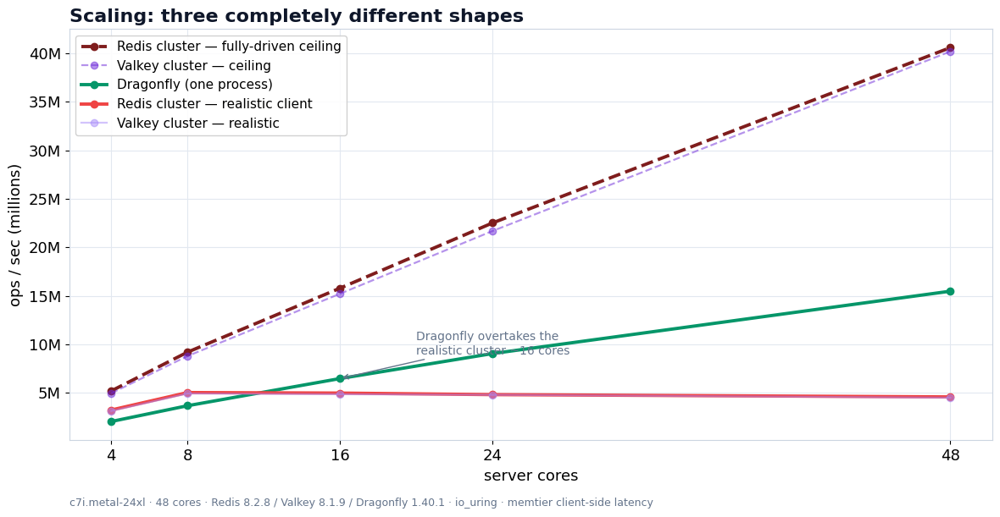

# Dragonfly vs Redis vs Valkey — a fair, reproducible benchmark

A methodology-first throughput/latency/memory benchmark of **Dragonfly**, **Redis**,
and **Valkey** on **48 real bare-metal cores** — with the harness, pinned versions,
and raw data so you can rerun and challenge every number.

📖 **Full write-up — every number on one page:** https://two-techies.com/blog/dragonfly-vs-redis-valkey-benchmark
🔬 **Interactive explorer — filter the raw runs yourself:** https://two-techies.com/benchmarks/dragonfly-redis-valkey
➕ **KeyDB and Garnet on the same harness:** https://two-techies.com/blog/keydb-vs-garnet-benchmark



## The headline (48 cores, read-heavy, pipelined)

| Configuration | Throughput |
|---|---|
| Redis Cluster — **fully driven** (per-shard routing) | **40.6M ops/s** (raw ceiling) |
| **Dragonfly** — single process | **15.5M ops/s** |
| Redis Cluster — **realistic** (a normal client) | **4.6M ops/s** |

All three are real. Redis's *raw* ceiling is higher, but you only reach it with
flawless client-side routing and a client as big as the server. Dragonfly gives
you **3.4× a realistic cluster** for near-zero operational effort. It's a trade-off
between **raw throughput and operational simplicity** — quantified.

## 🔬 Explore the raw runs in your browser

Don't take the tables on trust — **[open the interactive explorer](https://two-techies.com/benchmarks/dragonfly-redis-valkey)**
and filter every recorded run by engine, core count, workload, value size and
pipeline depth. Medians are computed live from the same CSVs in this repo, and
run health (hit rate, connection errors) is shown behind every plotted point.

- Main capture (Redis / Valkey / Dragonfly): https://two-techies.com/benchmarks/dragonfly-redis-valkey
- KeyDB + Garnet session: https://two-techies.com/benchmarks/keydb-garnet-benchmark

A dark-themed, self-contained copy ships here as `explorer.html` — serve the repo
root (`python3 -m http.server 8765`) and open `/explorer.html` to run it offline
against your own re-run.

## Also measured: KeyDB and Garnet

A second session pointed the same harness at the two engines almost nobody
benchmarks independently. **It used a different load generator, so these numbers
are not comparable to the table above** — only to each other.

| Engine (single process, 48 cores) | Throughput | p50 | bytes/key |
|---|---|---|---|
| **Garnet** 2.1.6 (Microsoft, .NET) | **≥21.4M ops/s** — client-limited, not a ceiling | 0.68 ms | not measured |
| **KeyDB** 6.3.4 | **636K ops/s** at 16 threads — *refuses to start above 16* | 22.85 ms | 200.3 |

Garnet scaled near-linearly to 16 cores and was still climbing at 48 when the
*client* saturated. KeyDB hit a hard architectural wall: above 16 server threads
it doesn't slow down, it fails to boot (`Invalid number of threads specified`).
Write-up: https://two-techies.com/blog/keydb-vs-garnet-benchmark

## TL;DR findings

- **Scaling:** Dragonfly scales smoothly 2M→15.5M; a *realistic* cluster plateaus ~5M
  (more shards don't help a normal client); the driven *ceiling* scales to ~40M.
- **The cluster-driving problem:** a single cluster-mode client under-reports a
  cluster by ~9× (shards sit ~16% idle) — so we report the cluster **two ways**.
- **Latency:** Dragonfly sub-ms; a well-driven cluster sub-ms too; a naive cluster
  client balloons to ~84ms p50 (client-side queuing).
- **Multi-key** (MGET/MSET across the keyspace): Dragonfly does it; clusters can't
  (CROSSSLOT) without hash-tag co-location.
- **Memory:** Dragonfly ~13% leaner (146 vs 165/169 bytes/key).

## What makes it fair

- **Three configurations, not two:** single-DF vs Redis/Valkey **cluster** (single
  Redis is one thread — you must cluster to use all cores). The cluster is reported
  both **realistic** and **fully-driven**.
- Client on a **separate, over-provisioned box**; every run proven **server-bound**.
- Keyspace **pre-populated** (reads hit real data, `hit_rate ≈ 1.0`).
- Each engine on its **own best I/O path** (Dragonfly `io_uring`, Redis/Valkey `epoll`).
- Images **pinned by digest**; every knob recorded per row.
- Full methodology (including a bias caught in our own setup): see the blog series.

## Known limits — stated, not buried

- **The fully-driven "ceiling" series is 1 repetition per point.** Every other
  series here is the median of 2. The *shape* reproduces across all five core
  counts, but treat the exact ceiling digits as ±.
- **Garnet's number is a floor, not a ceiling.** The load generator saturated
  before the server did, so the real figure is higher and unmeasured here.
- **Single node.** No failover, replication, or multi-node Dragonfly/Garnet
  cluster mode. Durability is off on every engine, identically — this is a cache
  comparison.
- **memtier is synthetic.** Uniform-random keys, no application serialisation.
  The harness accepts a different workload if you have a more representative one.

## Setup

- **Server:** AWS `c7i.metal-24xl` — bare metal, Intel Xeon 8488C (Sapphire Rapids),
  48 physical cores, single NUMA, 192 GB. **Client:** `c7i.24xlarge`. us-east-1, same AZ + placement group.
- **Versions:** Redis 8.2.8 · Valkey 8.1.9 · Dragonfly v1.40.1 · memtier_benchmark 2.5.1.

## Reproduce it

```bash
# 1. edit config.env (versions, cores, workload matrix)
# 2. single-box quick run (laptop/one box; Docker required):
bash scripts/run-phase-a.sh
# 3. two-box run (server + client, bare metal): see PHASE-B-RUNBOOK.md
# 4. the fully-driven cluster ceiling:
bash scripts/cluster-saturate.sh redis <server-ip> 7001 <shards>
# 5. regenerate the analysis tables from the raw data:
python3 analysis/analyze-aws.py     # tables -> results/FINDINGS.md
#    (the charts in images/ are pre-rendered; every number is re-derivable here)
```

## Repo layout

```
config.env             all knobs (pinned image digests, cores, workload matrix)
scripts/               the harness (up / bench / cluster-saturate / ramp / run-2box …)
analysis/              parse + report tables from runs.csv
results/
  runs-aws.csv         the raw capture (350 runs) — re-derive everything from this
  FINDINGS.md          analysis tables
  memory-aws.txt       bytes/key
  crossslot-aws.txt    the cross-slot operational demo
PHASE-B-RUNBOOK.md     exact AWS two-box setup
images/                the result charts (PNG)
```

## Credits & license

Benchmarking notes from **the DragonflyDB team** helped shape the approach. Harness released under the **MIT License**.
Rerun it, break it, tell me where I'm wrong — that's the point.
